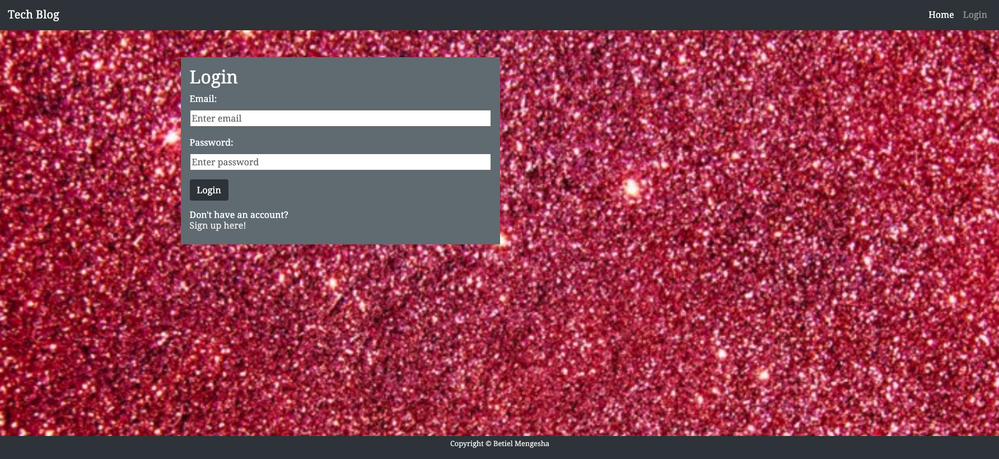
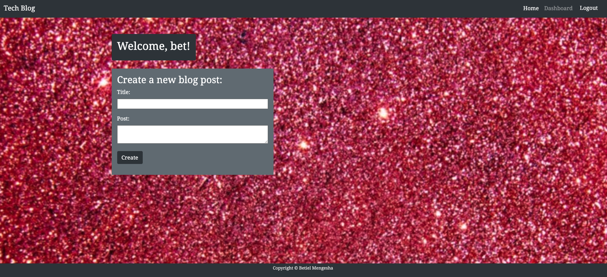

# Tech Blog

## Description


A blog site where developers can publish their blog posts and comment on other developers’ posts as well. This app follows the MVC paradigm in its architectural structure, using Handlebars.js as the templating language, Sequelize as the ORM, and the express-session npm package for authentication.

## User Story

```md
AS A developer who writes about tech
I WANT a CMS-style blog site
SO THAT I can publish articles, blog posts, and my thoughts and opinions
```

## Usage

To run the app the user must run the following commands


```
npm i

```
```
npm start

```


## Screnshots of the app functionality. 


#### login page



#### create a new blog post




## Deployment


* The URL of the functiona deployed application: https://powerful-springs-55895.herokuapp.com/

* The URL of the GitHub repository: https://github.com/betielbetu/Tech-Blog

---
© 2021 Betiel Mengesha. All Rights Reserved.
